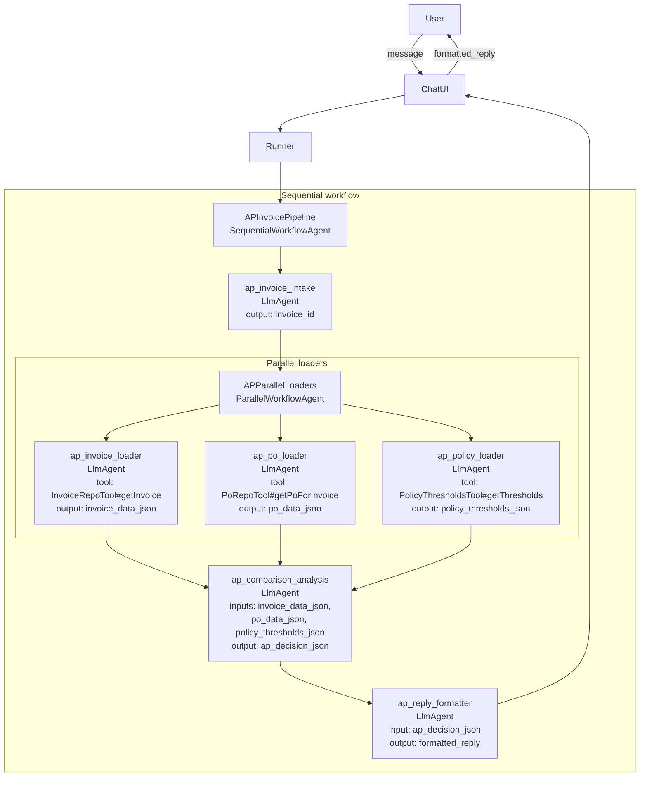
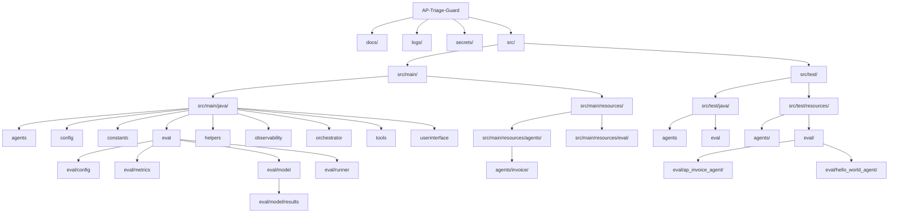

# ADK Java Agent – AP Triage Guard

This project is a Java 25 application built on Google’s Agent Development Kit (ADK).  
It implements an **AP Triage Guard** agent that:

- Takes natural‑language AP questions (e.g., “Can you check invoice INV‑1001?”),
- Loads simulated invoice/PO/policy data via tools,
- Applies policy thresholds, and
- Returns an “OK_TO_PAY / REVIEW / DO_NOT_PAY” decision with a short explanation.

The root entrypoint is `orchestrator.Main`, which starts a simple terminal chat loop:


---

## 1. Prerequisites

- **Java:** JDK 25
- **Build tool:** Maven 3.9+ (`mvn` on your `PATH`)
- **Google ADK dependencies:** downloaded automatically via Maven (`com.google.adk:google-adk` and `google-adk-dev`)
- A terminal that can run `mvn` commands, or an IDE such as IntelliJ IDEA / VS Code with Java support.

---

## 2. Required credentials and environment

Secrets are **not** committed to this repo.  
Instead, you must provide a few environment variables locally before running the app.

You can export them in your shell:

```bash
export GOOGLE_API_KEY="your-gemini-api-key"
export GOOGLE_APPLICATION_CREDENTIALS="/absolute/path/to/service-account.json"
export OTEL_RESOURCE_ATTRIBUTES="service.name=ap-triage-guard,gcp.project_id=your-gcp-project-id"
```

Alternatively, use the provided `.env` template:

1. Copy `.env.example` to `src/.env`.
2. Replace the placeholder values with your real keys and IDs.

`src/.env` is already listed in `.gitignore`, so your secrets will not be committed.

### 2.1 LLM / Gemini configuration

The agent uses the `gemini-2.5-flash` model via ADK.

Set:

- `GOOGLE_API_KEY` – **required** for using Gemini via the Google Generative Language API.  
  - Obtain this from Google AI Studio / Gemini API console.
  - Example: `export GOOGLE_API_KEY="AIza..."`
- `GOOGLE_GENAI_USE_VERTEXAI` – **optional** flag used by the ADK to select Vertex AI vs direct Gemini API.  
  - See the ADK documentation for supported values and setup.
- `ADK_LLM_LOG_LEVEL` – **optional** log level for detailed LLM/tool logging (`INFO`, `DEBUG`, etc.).  
  - This is consumed in `src/main/resources/logback.xml`.

> Note: This repository does not contain any API keys. You must supply your own `GOOGLE_API_KEY` (or equivalent Vertex AI configuration) locally.

### 2.2 Observability / Google Cloud telemetry

OpenTelemetry wiring lives in `src/main/java/config/OpenTelemetryBootstrap.java`.

There are two runtime modes:

1. **Local logging only (no Google Cloud)**  
   - Edit `src/main/java/orchestrator/Main.java` and set:
     ```java
     var loggingExporter = true;
     ```
   - This uses the `LoggingSpanExporter` and writes spans to standard output only.  
   - No Google Cloud credentials are required in this mode.

2. **Google Cloud traces + metrics**  
   - Leave `loggingExporter = false;` in `Main`.  
   - `OpenTelemetryBootstrap.initGCloud()` will:
     - Use **Application Default Credentials** (`GoogleCredentials.getApplicationDefault()`).
     - Send spans via OTLP gRPC (default endpoint `https://telemetry.googleapis.com:443` if none is set).
     - Export metrics via `GoogleCloudMetricExporter` (Cloud Monitoring).

   For this mode you need:

   - A **Google Cloud project** (e.g. `your-gcp-project-id`).
   - A **service account JSON key** with permissions to write telemetry, e.g.:
     - `roles/cloudtrace.agent`
     - `roles/monitoring.metricWriter`
   - Environment:
     - `GOOGLE_APPLICATION_CREDENTIALS` – **required**.  
       Absolute path to the service account JSON:
       ```bash
       export GOOGLE_APPLICATION_CREDENTIALS="/absolute/path/to/service-account.json"
       ```
     - `OTEL_EXPORTER_OTLP_ENDPOINT` – **optional**.  
       Overrides the OTLP endpoint. If unset, defaults to `https://telemetry.googleapis.com:443`.
     - `OTEL_RESOURCE_ATTRIBUTES` – **recommended**.  
       Used to tag spans/metrics with service name and project:
       ```bash
       export OTEL_RESOURCE_ATTRIBUTES="service.name=ap-triage-guard,gcp.project_id=your-gcp-project-id"
       ```
     - Alternatively, `GOOGLE_CLOUD_PROJECT` or `GCLOUD_PROJECT` can be set; `OpenTelemetryBootstrap` uses these as fallbacks for the project ID.

> Where to store the JSON key?  
> Keep it **outside** version control (for example under a `secrets/` folder, which is already in `.gitignore`) and never commit it to git.

---

## 3. Running the app

From the `AP-Triage-Guard` project root:

1. **Install dependencies & compile:**

   ```bash
   mvn -q -DskipTests compile
   ```

2. **Start the interactive AP Triage agent:**

   Using Maven’s exec plugin:

   ```bash
   mvn -q -DskipTests exec:java -Dexec.mainClass=orchestrator.Main
   ```

   This will:

   - Bootstrap OpenTelemetry (logging or GCP, depending on `loggingExporter` and env vars),
   - Register workflow wrappers and tools via `config.RegistrationService`,
   - Load the AP invoice pipeline from `src/main/resources/agents/invoice/ap-invoice-pipeline.yaml`,
   - Open a simple terminal chat (`ChatUI`) where you can type prompts.

3. **Interact with the agent:**

   - At the prompt, type natural‑language questions like:
     - `Can you check invoice INV-1001 for me?`
   - The agent will respond with a decision and explanation.
   - Type `quit` to exit.

> If your environment does not automatically load `.env` files, ensure that all required environment variables are exported in your shell **before** running `mvn exec:java`.

---

## 4. Running tests and evaluation suite

- **Run unit tests:**

  ```bash
  mvn test
  ```

  This includes agent and workflow tests under `src/test/java/**`.

- **Run the evaluation CLI (optional):**

  The project includes a small evaluation harness (`eval.EvalCli`) and example eval sets under `src/test/resources/eval/**`.  
  See `docs/evaluation-suite.md` for full details and example `mvn exec:java` commands.

---

## 5. Local secrets and `.env` files

- `src/.env` and `secrets/` are **ignored by git** (see `.gitignore`).
- You are encouraged to:
  - Store sensitive values (API keys, service account JSONs) there or elsewhere on your machine.
  - Never commit those files to version control.
- Before pushing to a new remote (e.g., GitHub), you can re‑run:

  ```bash
  gitleaks detect --source . --report-format json --redact
  ```

  to confirm that no secrets have been added to the git history.

## 6. Project Structure


